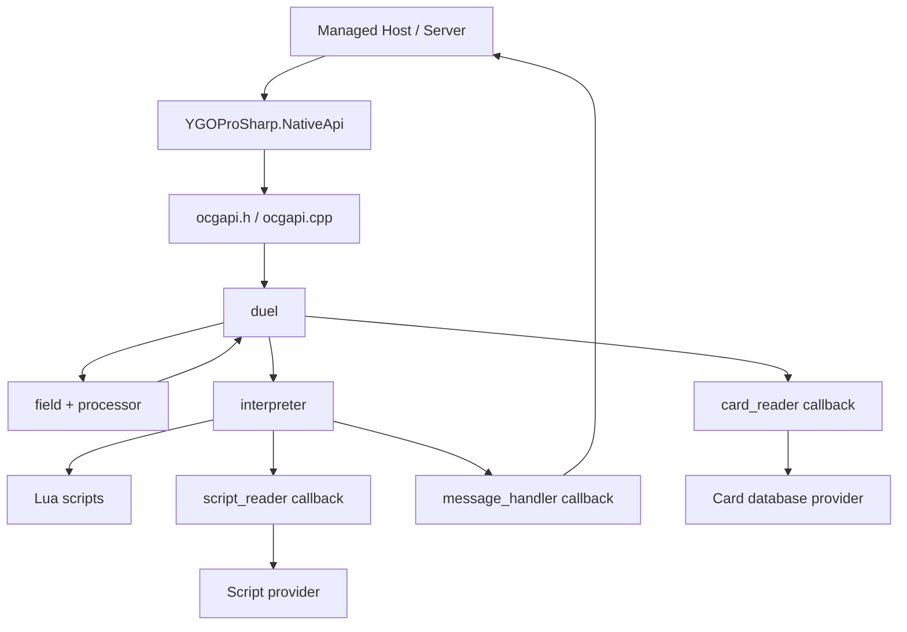
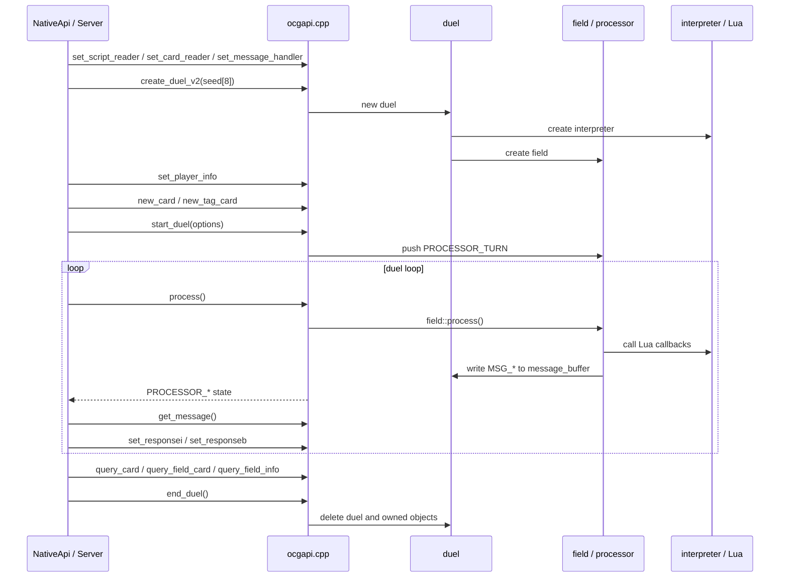

# YGOProSharp.Native

`YGOProSharp.Native` 是 YGOProSharp 的原生运行时（native runtime）项目。它只负责构建、保存和打包 `ocgcore` 动态库，不提供托管业务 API。

托管调用入口位于 `YGOProSharp.NativeApi`：它封装 `ocgapi.h` 的 raw binding、native handle、callback pinning 和 unsafe buffer。业务层应依赖 `YGOProSharp.Abstractions` / `YGOProSharp.NativeApi` 暴露的安全托管接口，不应直接调用 `ygopro-core`。

## 来源

- `ygopro-core`: <https://github.com/Fluorohydride/ygopro-core>
- Lua: <https://www.lua.org/>

`YGOProSharp.Native/ygopro-core` 是上游 `Fluorohydride/ygopro-core` 源码副本，也是本项目构建 `ocgcore` 的输入目录。`xmake.lua` 会把该目录下的 C++ 源码和 Lua 静态库一起编译成动态库。

## Runtime Assets

NuGet 包遵循标准 .NET native runtime asset 布局：

```text
runtimes/<rid>/native/
```

| RID | 原生文件 |
|---|---|
| `win-x64` | `ocgcore.dll` |
| `win-arm64` | `ocgcore.dll` |
| `linux-x64` | `libocgcore.so` |
| `linux-arm64` | `libocgcore.so` |
| `osx-x64` | `libocgcore.dylib` |
| `osx-arm64` | `libocgcore.dylib` |

本地构建产物会先输出到：

```text
YGOProSharp.Native/lib/<rid>/
```

打包时，`YGOProSharp.Native.csproj` 再把这些文件放入 `runtimes/<rid>/native/`。

## 构建

本项目使用 xmake 构建 native 库。Lua 版本固定为 `5.4.8`，第一次构建时会下载到 `.deps/`。

```powershell
cd YGOProSharp.Native
xmake f -c -p windows -a x64 -m release -y
xmake build ocgcore
```

Linux arm64 示例：

```bash
cd YGOProSharp.Native
xmake f -c -p linux -a arm64 -m release -y
xmake build ocgcore
```

> 注意：`ocgcore` 是构建 target，不是 xmake task。若直接执行 `xmake ocgcore` 遇到 `invalid task: ocgcore`，请改用 `xmake build ocgcore` 或 `xmake b ocgcore`。

## ygopro-core 架构

`ygopro-core` 是 OCG/YGOPro 对局规则引擎。它本身不负责网络、房间、卡组校验、数据库文件扫描或客户端协议；这些职责由 YGOProSharp 的 Core / Protocol / Server / NativeApi 层承担。native core 只维护单局 duel 状态，执行 Lua 卡片脚本，并通过 `MSG_*` 消息把状态变化和玩家选择请求交给托管层处理。



主要模块：

| 模块 | 职责 |
|---|---|
| `ocgapi.h` / `ocgapi.cpp` | C ABI 导出层。注册 `script_reader`、`card_reader`、`message_handler`，创建/销毁 duel，推进对局，查询场面，收发玩家响应。 |
| `duel.*` | 单局对局容器。持有 `interpreter`、`field`、随机数生成器、消息缓冲区，以及 card/group/effect 对象集合。 |
| `field.*` | 场地和双方玩家状态。保存生命值、手牌、主卡组、额外卡组、墓地、除外区、怪兽区、魔陷区、连锁和阶段等运行时状态。 |
| `processor.cpp` | 对局状态机。按 `PROCESSOR_*` 单元推进回合、阶段、连锁、召唤、战斗、伤害和玩家选择流程。 |
| `playerop.cpp` | 玩家操作请求与响应校验，例如选择卡、选择连锁、选择位置、宣言种族/属性/卡名等。 |
| `operations.cpp` | 具体规则动作，例如抽卡、移动、破坏、送墓、除外、召唤、特殊召唤、伤害和恢复。 |
| `card.*` / `card_data.h` | 卡片运行时对象和原始数据结构。`card_data` 与托管层 `OcgCardData` 对齐。 |
| `effect.*` / `effectset.h` | 效果对象、效果集合、发动条件、计数限制、reset 逻辑和目标关系。 |
| `group.*` | Lua 和规则流程中使用的卡片集合。 |
| `interpreter.*` | Lua 运行时封装。加载全局脚本和卡片脚本，注册 card/group/effect/duel/debug 库，调用 Lua condition/cost/target/operation。 |
| `libcard.cpp` / `libduel.cpp` / `libeffect.cpp` / `libgroup.cpp` / `libdebug.cpp` | 暴露给 Lua 卡片脚本的 C API。脚本通过这些函数读写 duel、card、effect、group 状态。 |
| `common.h` / `buffer.h` / `mtrandom.h` / `sort.h` | 常量、消息编号、buffer 编码、随机数和排序工具。 |

## 对局调用流程



流程说明：

1. 托管层先注册 `set_script_reader`、`set_card_reader`、`set_message_handler`。
2. 默认通过 `create_duel_v2(seed[8])` 创建 duel，初始化 `interpreter` 和 `field`。
3. 通过 `set_player_info` 设置 LP、初手、抽卡数，再用 `new_card` / `new_tag_card` 装载卡组。
4. `start_duel(options)` 开局，core 抽初手并压入 `PROCESSOR_TURN`。
5. 托管层循环调用 `process()`，core 推进 `field::process()` 并把 `MSG_*` 写入 `duel::message_buffer`。
6. 当 core 需要玩家响应时，托管层读取 `get_message()`，向客户端请求选择，再用 `set_responsei()` / `set_responseb()` 回填。
7. 需要场面快照时，托管层通过 `query_card()`、`query_field_card()`、`query_field_info()` 查询。
8. 对局结束时必须调用 `end_duel()`，释放 native duel 管理的 card/group/effect/field/interpreter。

## Lua API 类型文档

`lua-api/` 目录提供给 LuaLS / EmmyLua 使用的卡片脚本 API 描述，并通过 Xmake 本地 task 生成：

- [lua-api/README.md](lua-api/README.md)：使用方式、调用约定和维护规则。
- [lua-api/ygopro-core.lua](lua-api/ygopro-core.lua)：完整 `Card` / `Effect` / `Group` / `Duel` / `Debug` 类型声明。
- [lua-api/API-COVERAGE.md](lua-api/API-COVERAGE.md)：每个 API 对应的 C++ 入口和签名状态。
- [lua-api/examples](lua-api/examples)：最小脚本调用示例。

重新生成：

```powershell
xmake gen-lua-api -P YGOProSharp.Native
xmake gen-lua-api -P YGOProSharp.Native --check
```

这些文件只用于开发体验，不会被 `ocgcore` runtime 加载。

## CI 产物

CI 会按 RID 构建 `ocgcore`，并上传当前平台的 native 文件。发布 NuGet 包时，`YGOProSharp.Native` 作为 runtime assets 包被 CLI / Server 侧项目引用，保证运行输出目录里能拿到当前 RID 的 `ocgcore` 文件。
