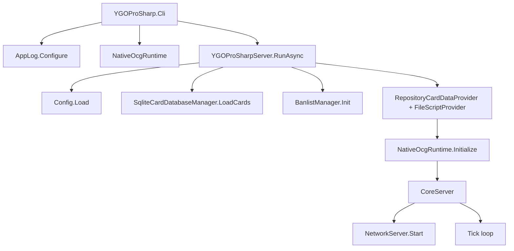
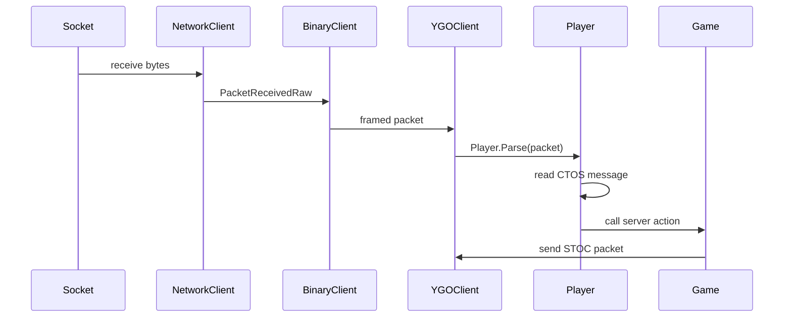
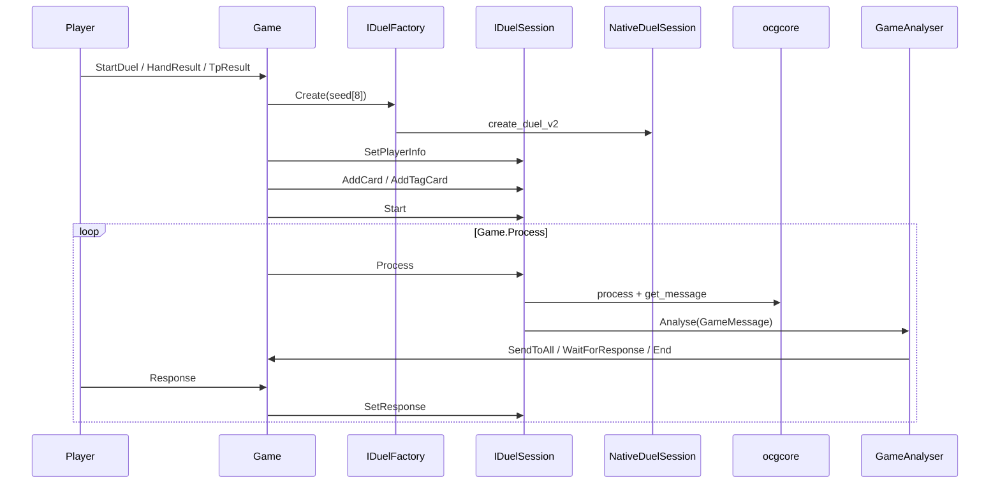
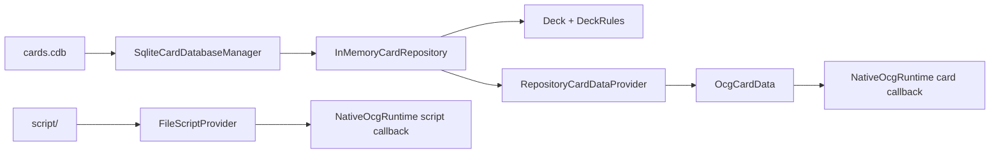
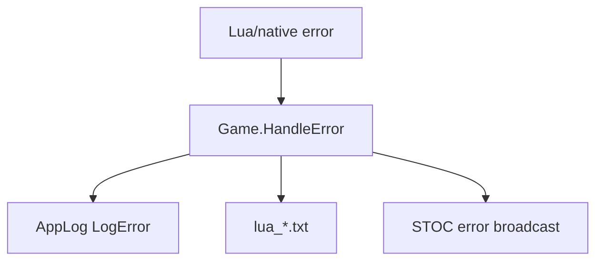

# YGOProSharp 调用流程

本文描述当前代码的主要运行路径。它只说明调用关系，不表示项目已经具备完整可玩能力。

## 启动流程

CLI 是组合根：它配置全局日志，创建 native runtime，然后把控制权交给 `YGOProSharp.Server`。Server 入口读取配置、加载卡库和禁限表，创建 native callback provider，并进入轻量 tick loop。

## 网络到玩家动作

`YGOProSharp.Protocol` 只负责 socket 与 YGO packet。`Player.Parse` 是 CTOS 业务入口：认证前只处理 `PlayerInfo`、`JoinGame`、`CreateGame`；认证后才处理聊天、移动座位、准备、更新卡组、response、投降等动作。

## 对局中的 native 调用

`Game` 负责选择随机种子、创建 `IDuelSession`、设置玩家信息、把双方卡组喂给 native，然后启动 duel。默认路径使用 `create_duel_v2(uint[8])`，由 `NativeDuelFactory.Create(ReadOnlySpan<uint>)` 封装。

## 卡片数据与脚本 callback

SQLite 读取只在 `SqliteCardDatabaseManager` 内部发生。业务层使用 repository 查询领域模型；native callback 使用 `RepositoryCardDataProvider` 把 `Card` 转成 `OcgCardData`。

脚本读取由 `FileScriptProvider` 完成，native 层只通过 `IScriptProvider` 请求脚本 bytes。

## 错误与日志

运行日志通过 `AppLog` 输出。生命周期默认走 `Information`；包级消息走 `Debug`；payload 短预览走 `Trace`。`Game.HandleError` 保留错误文件写入，同时输出结构化错误日志。
